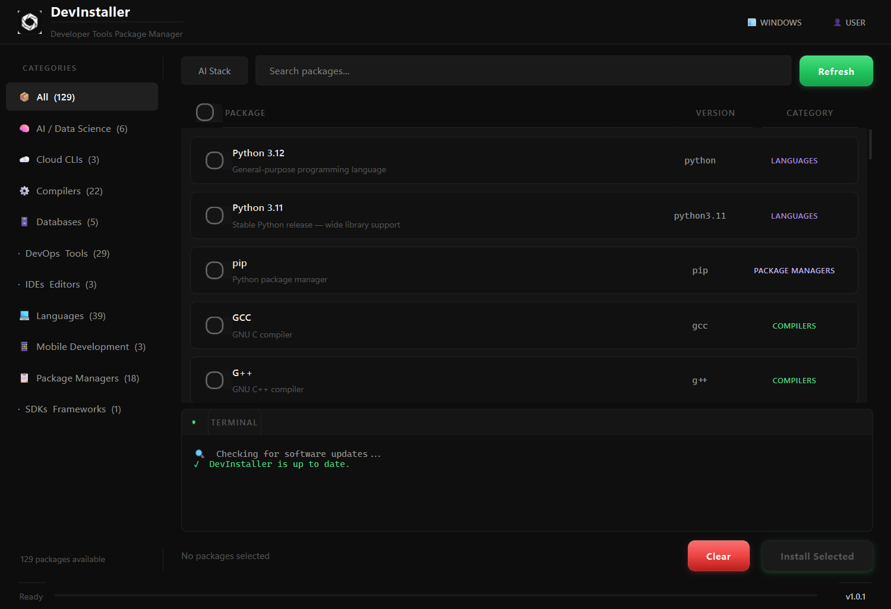

# DevInstaller



DevInstaller is a cross-platform desktop application that lets developers search, select, and install programming languages, compilers, SDKs, and developer tools from a comprehensive catalog — all from a single, premium Qt-based GUI.

## About

DevInstaller simplifies the setup process for developers by providing a unified interface to install tools across different operating systems. It uses native package managers (`winget`, `apt`, `brew`) and automatically handles PATH configurations, ensuring your environment is ready to use without manual tweaking.

## Features

- **Cross-Platform:** Works on Windows, Linux, and macOS using native package managers.
- **Auto-Updater:** Automatically checks for new releases on GitHub at startup. Displays a premium update dialog with release notes, a smooth animated progress bar, and handles silent self-updating installation.
- **AI-Powered Enrichment:** Integrates with the Gemini API to dynamically enrich metadata, compiler, interpreter, and language information.
- **Premium Monochrome UI:** Features a modern dark theme layout, status badges, uniform item padding, and fluid animations.
- **Smart Install:** Automatically detects and skips already installed tools to save time.
- **Configurable:** Easily customize the available tools by editing `tools.json` and persist configuration keys via `.env` or `config.json`.

## Installation & Usage

### Requirements
- **Python 3.10+**
- **[uv](https://docs.astral.sh/uv/)**

*Note: On Windows, it is recommended to run elevated: `uv run python -m udm --elevate`*

## Quick Install (Automated Setup)

The cross-platform setup scripts detect your OS, download the latest release,
verify it, and install it automatically.

**Linux / macOS**

```bash
curl -fsSL https://gitlab.com/faizan-fatmi-group/devinstaller/-/raw/main/scripts/install.sh | bash
```

**Windows (PowerShell)**

```powershell
irm https://gitlab.com/faizan-fatmi-group/devinstaller/-/raw/main/scripts/install.ps1 | iex
```

The scripts are configurable via environment variables (release provider,
version, install directory). By default they use this project's GitLab
releases; set `DEVINSTALLER_PROVIDER=github` and `DEVINSTALLER_GITHUB_REPO=owner/repo`
to pull from a GitHub mirror instead.

## Building Distributables

### Using Meson

```bash
meson setup builddir
meson compile -C builddir build-exe       # Windows .exe
meson compile -C builddir build-appimage  # Linux AppImage
meson compile -C builddir build-dmg       # macOS .dmg
```

## License

DevInstaller is licensed under the MIT License. See the [`LICENSE`](LICENSE) file for more information.
